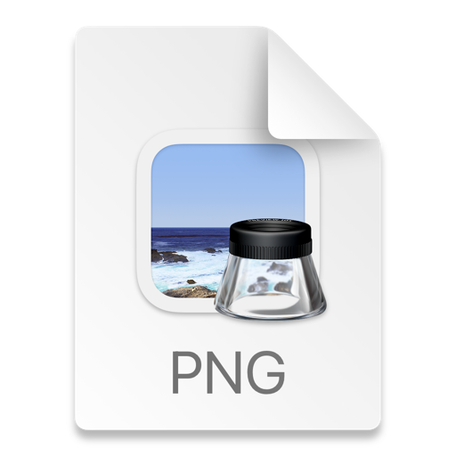

# ArogyaNidhi – Healthcare Scheme Eligibility App

## Overview

ArogyaNidhi is an Android healthcare assistance application designed to help rural and economically vulnerable families identify government healthcare schemes they are eligible for. The app simplifies access to healthcare information by providing eligibility checking, document guidance, hospital search, and AI-powered assistance.

---

## Problem Statement

Many families are unaware of government health schemes and healthcare benefits available to them. Due to lack of awareness, people often spend money on treatments that could have been covered through free or subsidized government programs.

ArogyaNidhi aims to reduce this information gap and help users easily access healthcare-related schemes and services.

---

## Features

### Eligibility Checker
- Step-by-step eligibility questionnaire
- Decision-based healthcare scheme recommendation
- Personalized results based on income, occupation, BPL status, and family details

### Government Scheme Information
- Detailed information about healthcare schemes
- Eligibility criteria
- Benefits provided
- Required documents

### Document Checklist
- Checklist of documents required for each scheme
- Local storage using Room Database
- Track prepared and pending documents

### Hospital Finder
- District-wise hospital search
- Karnataka district support
- Empanelled hospital listing
- Google Maps navigation integration

### User Authentication
- Firebase Authentication
- User profile management
- Cloud Firestore integration

### AI Healthcare Chatbot
- AI-powered chatbot using Gemini API
- Answers healthcare scheme-related questions
- Provides guidance and support
---

## Technologies Used

- Kotlin
- Android Studio
- Jetpack Compose
- Firebase Authentication
- Cloud Firestore
- Room Database
- Gemini AI API
---

## Application Flow

1. User logs into the app
2. User completes eligibility questionnaire
3. App displays eligible healthcare schemes
4. User views required documents
5. User searches nearby hospitals
6. AI chatbot assists with healthcare scheme guidance

---

## Project Structure

```text
## Project Structure

```text
app/
├── manifests/
├── kotlin+java/
│   └── com.example.arogyanidhi/
│       ├── data/
│       │   ├── local/
│       │   ├── remote/
│       │   └── repository/
│       │
│       ├── di/
│       │
│       ├── domain/
│       │   ├── model/
│       │   └── repository/
│       │
│       ├── network/
│       │
│       ├── ui/
│       │   ├── auth/
│       │   ├── chatbot/
│       │   ├── dashboard/
│       │   ├── eligibility/
│       │   ├── hospitals/
│       │   ├── navigation/
│       │   ├── onboarding/
│       │   ├── profile/
│       │   ├── schemes/
│       │   ├── settings/
│       │   ├── splash/
│       │   └── theme/
│       │
│       ├── util/
│       │
│       ├── ArogyaNidhiApp.kt
│       └── MainActivity.kt
│
├── res/
└── Gradle Scripts/
```
```

---

## Installation Steps

### Clone Repository

```bash
git clone https://github.com/Amulya125/ArogyaNidhi-healthcare-App-.git
```

### Open in Android Studio

- Open Android Studio
- Select "Open Project"
- Choose the cloned repository folder

### Build Project

- Sync Gradle files
- Connect emulator or Android device
- Run the application

---

## Demo Link

https://appetize.io/app/b_ypnmiu3qzaydmf5mvvz6hxxpii

---

## Screenshots

- login page- []
- home screen- []
- eligibility checker- question 1[]
-                     -question 2[]
-                     -question 3[]
-                     -question 4[]
-                     -question 5[]
- eligibile schemes after quiz- []
- empanelled hospitals-[]
- search hospitals by district -[]
- all government schemes - [] 
- document checklist - []
- profile-[]
- AI chatbot-[]
```

---

## Future Improvements

- Multi-language support
- Voice assistant integration
- Live hospital API integration
- Real-time healthcare scheme updates
- Appointment booking support
- Improved AI healthcare assistance

---

## Impact Goals

- Improve awareness about government healthcare schemes
- Reduce healthcare information barriers
- Support financially vulnerable communities
- Improve access to healthcare services
- Promote digital healthcare accessibility

---

## Author

Amulya A (questers-G5)

---

## License

This project is developed for educational and internship evaluation purposes.